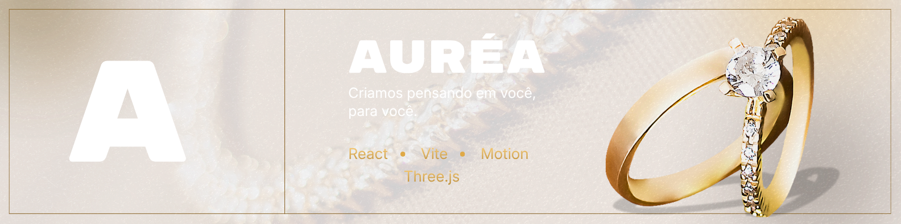
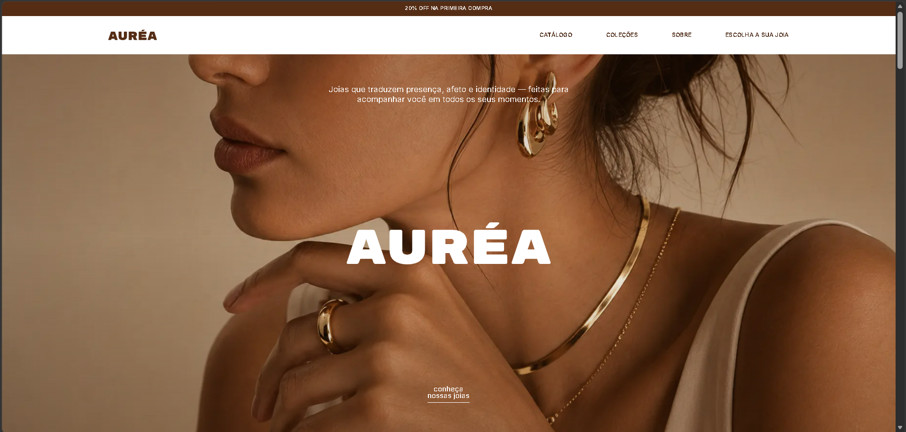
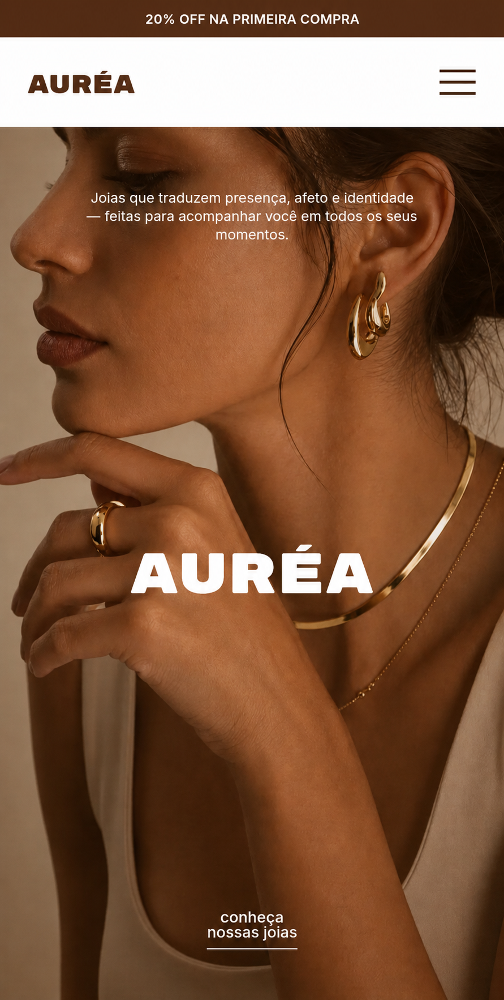

    

 

<h1 align="center">Auréa Joias</h1>

    <em>Joias que traduzem presença, afeto e identidade.</em>

    Experiência digital conceitual criada para transformar uma vitrine de joias 
    em uma narrativa visual elegante, sensorial e orientada à descoberta.

 

    
    
    
    

 
 

<h2 align="center">✦ O projeto</h2>

    A <strong>Auréa Joias</strong> é uma marca fictícia criada para este case de 
    UI/UX Design e desenvolvimento front-end.

    A proposta foi construir uma vitrine digital com atmosfera editorial, 
    valorizando os detalhes das peças e a identidade de quem as usa.

 
 

<h2 align="center">✦ Uma experiência em diferentes telas</h2>

    O layout não apenas diminui no mobile: enquadramentos, movimentos, 
    navegação e distribuição do conteúdo se adaptam a cada contexto.

 

<table align="center">
    <tr>
        <td align="center" valign="middle">
            
        </td>
        <td align="center" valign="middle">
            
        </td>
    </tr>
    <tr>
        <td align="center">
            DESKTOP
        </td>
        <td align="center">
            MOBILE
        </td>
    </tr>
</table>

 
 

<h2 align="center">✦ Por trás da experiência</h2>

    Cada escolha visual e técnica foi pensada para apresentar as joias 
    com leveza, personalidade e movimento.

 

<table align="center" width="100%">
    <tr>
        <td width="50%" align="center" valign="top">
            

                <strong>Vitrine em movimento</strong>
                  
                Um catálogo contínuo apresenta as peças com fluidez e
                mantém a descoberta sempre em movimento.
            

        </td>
        <td width="50%" align="center" valign="top">
            

                <strong>Narrativa editorial</strong>
                  
                Imagens, tipografia e composição constroem uma experiência visual
                sofisticada sem perder a clareza.
            

        </td>
    </tr>
    <tr>
        <td width="50%" align="center" valign="top">
            

                <strong>Experiência 3D</strong>
                  
                Um anel tridimensional reage à rolagem e revela seu design por
                diferentes ângulos ao longo da navegação.
            

        </td>
        <td width="50%" align="center" valign="top">
            

                <strong>Responsividade real</strong>
                  
                Galerias, coleções e interações assumem comportamentos próprios
                no desktop, tablet e mobile.
            

        </td>
    </tr>
</table>

 
 

<h2 align="center">✦ Construído para encantar</h2>

    Barra promocional · Header responsivo · Hero imersiva · Catálogo contínuo 
    Galeria adaptativa · Coleções sticky · Anel 3D · Fallback WebGL 
    Carregamento sob demanda · Movimento reduzido · CTA animado

 
 

<h2 align="center">✦ Tecnologias</h2>

    

 

    <strong>React</strong> para componentização e construção da interface 
    <strong>Motion</strong> para animações e transições orientadas ao scroll 
    <strong>Embla Carousel</strong> para carrosséis e rolagem automática 
    <strong>Three.js</strong> para renderização e interação com o anel 3D

 
 

<h2 align="center">✦ Executando o projeto</h2>

<strong>Ver instruções</strong>

 

Clone o repositório:

git clone https://github.com/evellynmayarax/aurea-joias.git

Entre na pasta:

cd aurea-joias

Instale as dependências:

npm install

Inicie o ambiente de desenvolvimento:

npm run dev

Para acessar pela rede local:

npm run dev -- --host

Gere o build de produção:

npm run build

 
 

<h2 align="center">✦ Projeto conceitual</h2>

    Auréa Joias é uma marca fictícia criada exclusivamente para este case 
    e para apresentação em portfólio.

    Produtos, preços, contatos, imagens e demais informações 
    possuem caráter meramente ilustrativo.

 
 

<h2 align="center">✦ Criado por</h2>

<h3 align="center">
    <a href="https://evellynsilva.dev">
        Evellyn Silva
    </a>
</h3>

    UI/UX Design & Desenvolvimento Front-end

    
    
    

 

 

    

    <strong>Criamos pensando em você, para você.</strong>

    
        © 2026
        <a href="https://evellynsilva.dev">evellyn silva.</a>
        Todos os direitos reservados.
    

